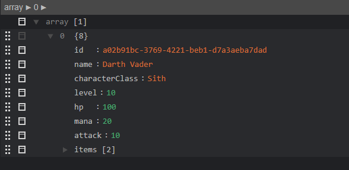
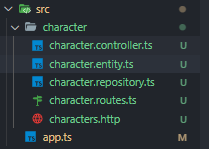

<!-- START doctoc generated TOC please keep comment here to allow auto update -->
<!-- DON'T EDIT THIS SECTION, INSTEAD RE-RUN doctoc TO UPDATE -->
**Table of Contents**  *generated with [DocToc](https://github.com/thlorenz/doctoc)*

- [Express](#express)
- [Pasos para inciarse con typescript](#pasos-para-inciarse-con-typescript)
  - [Set up del projecto](#set-up-del-projecto)
- [01. Express](#01-express)
- [02. Express GET POST PUT DELETE](#02-express-get-post-put-delete)
  - [GET getAll](#get-getall)
  - [GET getOne](#get-getone)
  - [POST](#post)
  - [Put y Patch](#put-y-patch)
  - [Sanitizar la entrada de datos](#sanitizar-la-entrada-de-datos)
  - [Delete](#delete)
  - [URL que no existe](#url-que-no-existe)

<!-- END doctoc generated TOC please keep comment here to allow auto update -->

# Express

Utilizando la configuración de typescript

# Pasos para inciarse con typescript

## Set up del projecto

1. Crear un package.json
   con pnpm

   ```bash
   pnpm init
   ```

   or con npm

   ```bash
   npm --init -y
   ```

Modificamos el archivo package y agregamos type:module
```json
   {
  "name": "01-express",
  "version": "1.0.0",
  "type": "module",
  "description": "",
  "main": "index.js",
  "scripts": {
    "test": "echo \"Error: no test specified\" && exit 1"
  },
  "keywords": [],
  "author": "",
  "license": "ISC",
  "devDependencies": {
    "tsc-watch": "6.0.4",
    "typescript": "5.1.3"
  },
  "dependencies": {
    "express": "^4.19.2"
  }
}
```

2. Editar el package.json y especificar type:module

3. Instalar las dependencias de desarrollo, se puede utilizar npm o pnpm

   Vamos a especificar las versiones de typescript y tsc-watch en la instalación para evitar cambios en los parámetros entre el momento de escribir el documento y cuando se lo estén siguiendo pueda causar comportmientos diferentes. Esto instalará la utilidad de compilaciónde typescript tsc y tsc-watch que utilizaremos para el hot-reload

   con pnpm

   ```bash
   pnpm add -D typescript@5.1.3
   pnpm add -D tsc-watch@6.0.4
   ```

   o con npm

   ```bash
   npm install --save-dev typescript@5.1.3
   npm install --save-dev tsc-watch@6.0.4
   ```

   _Nota_: Node.js no cuenta con los tipos de TypeScript para sus librerías base como por ejemplo http o fs. Para poder utilizarlos correctamente se debe agregar la dependencia @types/node

4. Generar la configuración de compilación de tsconfig.json

   TypeScript se debe compilar a javascript que luego se ejecuta sobre Node.js por ello crearemos unac config para TypeScript

   ```bash
   tsc --init
   ```

5. Editar el contenido del archivo tsconfig.json y configurarlo así

   ```json
   {
     "compilerOptions": {
       "incremental": true,
       "target": "es2020",
       "module": "ES2022",
       "moduleResolution": "bundler",
       "sourceMap": true,
       "outDir": "./dist",
       "esModuleInterop": true,
       "forceConsistentCasingInFileNames": true,
       "strict": true,
       "alwaysStrict": true,
       "skipLibCheck": true,
       "emitDecoratorMetadata": true,
       "experimentalDecorators": true
     },
     "include": ["src/**/*", "**/*.ts"],
     "exclude": ["node_modules"]
   }
   ```

6. Crear los directorios src y dist.

   En base a nuestra config anterior tendremos nuestro código fuente en el directorio src y el compilador de TypeScript dejará los archivos compilados en dist.

7. Crear un archivo para probar `src/index.ts`

8. Configurar VS Code / Codium para incluir extensiones en los imports

   Debido a recientes cambios en las versiones más nuevas de TS y Node.js al usar "type":"module" y con la configuración que estamos utilizando al tratar de ejecutar el código los imports de Node.js nos requeriran que incluyamos la extensión del mismo.

   Por lo tanto vamos a setear esto en la configuración del editor para que lo haga automáticamente. En las settings vamos a buscar `preferences:import ending` y vamos a setear para JavaScript y TypeScript `Preferences: Import Module Specifier Ending` en `.js/ .ts`

   Si editan directamente las settings en el archivo serían

   ```json
   "javascript.preferences.importModuleSpecifierEnding": "js",
   "typescript.preferences.importModuleSpecifierEnding": "js"
   ```

9. En el package .json agregar estos scripts

   ```json
    "build": "tsc -p ./tsconfig.json",
    "start:dev": "tsc-watch --noClear -p ./tsconfig.json --onSuccess \"node ./dist/index.js\""
   ```

10. Setear las run configurations para ejecutar desde VS Code / Codium

    ```json
    {
      // Use IntelliSense to learn about possible attributes.
      // Hover to view descriptions of existing attributes.
      // For more information, visit: https://go.microsoft.com/fwlink/?linkid=830387
      "version": "0.2.0",
      "configurations": [
        {
          "name": "build",
          "request": "launch",
          "runtimeArgs": ["build"],
          "runtimeExecutable": "pnpm",
          "skipFiles": ["<node_internals>/**"],
          "type": "node"
        },
        {
          "name": "start:dev",
          "request": "launch",
          "runtimeArgs": ["start:dev"],
          "runtimeExecutable": "pnpm",
          "skipFiles": ["<node_internals>/**"],
          "type": "node"
        }
      ]
    }
    ```


# 01. Express

Inicializamos el gestor de paquetes
```bash
pnpm --init
```

Modificamos el archivo package y agregamos type:module
```json
   {
  "name": "01-express",
  "version": "1.0.0",
  "type": "module",
  "description": "",
  "main": "index.js",
  "scripts": {
    "test": "echo \"Error: no test specified\" && exit 1"
  },
  "keywords": [],
  "author": "",
  "license": "ISC",
  "devDependencies": {
    
  },
  "dependencies": {
  }
}
```


Para instalar las dependencias de express

```
pnpm add express
```

Proseguiremos a instalar más dependencias

```bash
pnpm add -E -D typescript tsc-watch @types/express @types/node
```

app.js será el root

Para inicializar express.

con .use decimos que cualquier request que se haga en la raiz de nuestro sitio en este caso se ejecute el siguiente codigo

```ts
import express from 'express'

const app = express()

app.use('/', (req, res) =>{
    res.send('Hello')
})

app.listen(3000, () =>{
    console.log('Server running on http://localhost:3000/')
})
```

Más configuración en el package.json, agregamos el script para que se ejecute. start:dev:"tsc..."

```json
{
  "name": "01-express",
  "version": "1.0.0",
  "type": "module",
  "description": "",
  "main": "index.js",
  "scripts": {
    "test": "echo \"Error: no test specified\" && exit 1",
    "start:dev":"tsc-watch --noClear -p ./tsconfig.json --onSuccess \"node ./dist/app.js\" "
  },
  "keywords": [],
  "author": "",
  "license": "ISC",
  "devDependencies": {
    "@types/express": "4.17.21",
    "@types/node": "20.12.7",
    "tsc-watch": "6.0.4",
    "typescript": "5.1.3"
  },
  "dependencies": {
    "express": "^4.19.2"
  }
}
```

Y queda funcionando, lo probamos con 

```bash
pnpm start:dev
```

Para devolver en un formato JSON

```ts
import express from 'express'

const app = express()

app.use('/', (req, res) =>{
    res.json({ message:'Esto es un mensaje'})
})

app.listen(3000, () =>{
    console.log('Server running on http://localhost:3000/')
})
```

# 02. Express GET POST PUT DELETE

## GET getAll
Para realizar un GET antes creamos una clase.


```ts
import crypto from 'node:crypto'

export class Character {
  constructor(
    public name: string,
    public characterClass: string,
    public level: number,
    public hp: number,
    public mana: number,
    public attack: number,
    public items: string[],
    public id = crypto.randomUUID()
  ) {}
}
```
En nuestro app.ts
```ts
import express from 'express'
import { Character } from './character.js'


const app = express()

const characters = [
    new Character(
      'Darth Vader',
      'Sith',
      10,
      100,
      20,
      10,
      ['Lightsaber', 'Death Star'],
      'a02b91bc-3769-4221-beb1-d7a3aeba7dad',
    ),
  ]


app.use('/api/characters/', (req, res) =>{
    res.json(characters)
})

app.listen(3000, () =>{
    console.log('Server running on http://localhost:3000/')
})
```
Como resultado



## GET getOne

La url cambiará /api/characters/:id

Agregaremos otro get

```ts
app.get('/api/characters/:id', (req, res) => {
  const character = characters.find((character) => character.id === req.params.id)
  if (!character) {
    return res.status(404).send({ message: 'Character not found' })
  }
  res.json({ data: character })
})
```

## POST

Para introducir un personaje. La información viene del cuerpo de la petición. Es decir, dentro de la request.body pero sucede que el body puede venir en varios paquetes http no se encuentra necesariamente completo por lo que hay que recurrir a un middleware.

El usuario -> request -> express ->(aca no llega toda la info) app.post -> response -> al usuario


El usuario -> request -> express -> middleware que forme el req.body -> app.post -> response -> al usuario


Asi que creamos el middleware y asignarselo a todas las rutas

El usuario -> request -> express -> express.json() -> app.post -> response -> al usuario


```ts
app.use(express.json())
```

```ts
 app.post('/api/characters', (req, res) =>{

    const {name, characterClass, level, hp, mana, attack, items} = req.body
    const character = new Character(name, characterClass, level, hp, mana, attack, items)
    
    characters.push(character)
    return res.status(201).send({ message: 'Character created', data: character })
  })
```

Si bien ya funciona podemos ser mas consistentes en vez de tener 3 estructuras completamente distitnas para hacer nuestra entrega al usuario podriamos agregarle {data: characters} a cada uno. **Nos sirve para separar en mensajes y datos.**


```ts
app.use('/', (req, res) =>{
    res.json({data: characters})
})
```
## Put y Patch

Se suele elegir el put porque permite la modificacion completa del elemento y asegura un sentido idempotente -> no importa cuanta veces que se ejecute, el resultado será el mismo.

```ts
app.put('/api/characters/:id', (req, res)=>{
  const characterIndex = characters.findIndex(character => character.id === req.params.id)

  if(characterIndex === -1){
    return res.status(404).send('Character not found')
  }

  const input = {
    name: req.body.name,
    characterClass: req.body.characterClass,
    level: req.body.level,
    hp: req.body.hp,
    mana: req.body.mana,
    attack: req.body.attack,
    items: req.body.items
  }

  characters[characterIndex] = [...characters[characterIndex], input ]
  return res.status(200).send({message: 'Character updated succesfully', data: characters[characterIndex]})
})
```

## Sanitizar la entrada de datos

Separaremos la sanitización en una función.

La función next() se invocará al final de nuestra función, se procesará la info y cuando diga next() se irá a una de las rutas.

Este codigo evita agregar una propiedad que no exista en nuestro modelo en tiempo de ejecución.

```ts
import express, { NextFunction, Request, Response } from 'express'
function sanitizeCharacterInput(req: Request, res: Response){

  req.body.sanitiziedInput = {
    name: req.body.name,
    characterClass: req.body.characterClass,
    level: req.body.level,
    hp: req.body.hp,
    mana: req.body.mana,
    attack: req.body.attack,
    items: req.body.items
  }

// Más validaciones aquí

  next()
}
```

Para utilizar esto debemos agregarlo en nuestro post y put

```ts
app.post('/api/characters', sanitizeCharacterInput, (req, res) => {

  const input = req.body.sanitizedInput

  const character = new Character(
    input.name,
    input.characterClass,
    input.level,
    input.hp,
    input.mana,
    input.attack,
    input.items
  )

  characters.push(character)
  return res.status(201).send({ message: 'Character created', data: character })
})
```

```ts
app.put('/api/characters/:id', sanitizeCharacterInput, (req, res) => {
  const characterIdx = characters.findIndex((character) => character.id === req.params.id)

  if (characterIdx === -1) {
    return res.status(404).send({ message: 'Character not found' })
  }

  characters[characterIdx] = { ...characters[characterIdx], ...req.body.sanitizedInput }

  return res.status(200).send({ message: 'Character updated successfully', data: characters[characterIdx] })
})
```

## Delete

Para la eliminación de un recurso

```ts
app.delete('/api/characters/:id', (req, res) => {
  const characterIdx = characters.findIndex((character) => character.id === req.params.id)

  if (characterIdx === -1) {
    return res.status(404).send({ message: 'Character not found' })
  } else {
    characters.splice(characterIdx, 1)
    return res.status(200).send({ message: 'Character deleted successfully' })
  }
})
```

## URL que no existe

Al final de nuestro código antes del app.listen pondremos otro middleware.

```ts
app.use((_, res) => {
  return res.status(404).send({ message: 'Resource not found' })
})
```

# 03. Express MVC

Distribuiremos el proyecto la siguiente manera.

Cumpliendo con el single-responsability (archivo o clase con una sola responsabilidad) y combinando con vertical-slices, división de nuestra app en modulos o componentes que se encarguen de una parte de nuestra aplicación. En nuestro caso tenemos un CRUD de characters -> creamos una carpeta characters con los siguientes archivos. Donde entity era el character.ts anterior.



El repository ts en general hace referencia al acceso a la base de datos. Nosotros en un futuro aplicaremos un ORM con un patrón llamado Data-Mapper.

## Repository

Creamos una carpeta llamada shared con un archivo repository.ts
En repository.ts declararemos una interfaz que permitirá que todos los repositorios implementen los elementos que definiremos y que yo no tenga una implementación que se aleje del estandar que yo quiero.

findAll devolverá o una lista o undefined luego lo reemplazaremos con una Promesa.
findOne devolverá o un objeto generico T o undefined.
...
...

Para findOne y delete voy a recibir un solo elemento donde se **exige** que el elemento tenga un **id**

```ts
export interface Repository<T> {

    findAll(): T[] | undefined
    findOne(item: {id: string}): T | undefined
    add(item: T): T | undefined
    update(item: T): T | undefined
    delete(item: {id:string}): T | undefined

}
```

Habiendo creado la interfaz vamos a crear nuestra clase que implementa la interfaz. La sanitización de la entrada no corresponde a esta capa. Esta solo es de acceso a datos.

```ts
import { Repository } from "../shared/repository.js"}
import { Character } from "./character.entity.js"

const characters = [
    new Character(
      'Darth Vader',
      'Sith',
      10,
      100,
      20,
      10,
      ['Lightsaber', 'Death Star'],
      'a02b91bc-3769-4221-beb1-d7a3aeba7dad'
    ),
  ]


export class CharacterRepository implements Repository<Character>{


    public findAll(): Character[] | undefined {
        return characters
    }

    public findOne(item: { id: string }): Character | undefined {
        return characters.find((character) => character.id === item.id)
      }

    
    public add(item: Character): Character | undefined {
        characters.push(item)
        return item
    }

    public update(item: Character): Character | undefined {
        const characterIdx = characters.findIndex((character) => character.id === item.id)
    
        if (characterIdx !== -1) {
          characters[characterIdx] = { ...characters[characterIdx], ...item }
        }
        return characters[characterIdx]
      }

      public delete(item: { id: string }): Character | undefined {
        const characterIdx = characters.findIndex((character) => character.id === item.id)
    
        if (characterIdx !== -1) {
          const deletedCharacters = characters[characterIdx]
          characters.splice(characterIdx, 1)
          return deletedCharacters
        }
      }

}
```

Ahora realizaremos las modificaciones al app.ts eliminamos el array de characters y ponemos const repository = new CharacterRepository() obviamente lo importamos también, luego lo terminaremos moviendo pero para una primera etapa va.

```ts
import { CharacterRepository } from './character/character.repository.js'
...
...
const repository = new CharacterRepository()
...
...
```

Luego en el get characters

```ts
app.get('/api/characters', (req, res) => {
  res.json({ data: repository.findAll() })
})
```
getOne
```ts
app.get('/api/characters/:id', (req, res) => {
  const character = repository.findOne({ id:req.params.id })
  if (!character) {
    return res.status(404).send({ message: 'Character not found' })
  }
  res.json({ data: character })
})
```
add

```ts
app.post('/api/characters', sanitizeCharacterInput, (req, res) => {
  const input = req.body.sanitizedInput

  const character = new Character(
    input.name,
    input.characterClass,
    input.level,
    input.hp,
    input.mana,
    input.attack,
    input.items
  )

  repository.add(character)
  return res.status(201).send({ message: 'Character created', data: character })
})
```

put

```ts
app.put('/api/characters/:id', sanitizeCharacterInput, (req, res) => {

  req.body.sanitizedInput.id = req.params.id
  const character = repository.update(req.body.sanitizedInput)

  if (!character) {
    return res.status(404).send({ message: 'Character not found' })
  }

  return res.status(200).send({ message: 'Character updated successfully', data: character })
})
```

delete

```ts
app.delete('/api/characters/:id', (req, res) => {
  const id = req.params.id
  const character = repository.delete({ id })

  if (!character) {
    res.status(404).send({ message: 'Character not found' })
  } else {
    res.status(200).send({ message: 'Character deleted successfully' })
  }
})
```
## Controller y routes

Inicialmente comentaremos todo el app.algo y la sanitización la llevaremos al controlador.

```ts
import { Request, Response, NextFunction } from 'express'
import { CharacterRepository } from './character.repository.js'
import { Character } from './character.entity.js'

const repository = new CharacterRepository()

function sanitizeCharacterInput(req: Request, res: Response, next: NextFunction) {
  req.body.sanitizedInput = {
    name: req.body.name,
    characterClass: req.body.characterClass,
    level: req.body.level,
    hp: req.body.hp,
    mana: req.body.mana,
    attack: req.body.attack,
    items: req.body.items,
  }
  //Más validaciones aquí

  Object.keys(req.body.sanitizedInput).forEach((key) => {
    if (req.body.sanitizedInput[key] === undefined) {
      delete req.body.sanitizedInput[key]
    }
  })
  next()
}

function findAll(req: Request, res: Response) {
  res.json({ data: repository.findAll() })
}

export { sanitizieCharacterInput, findAll}
```

Y en las rutas haremos una especie de indice por cada vertical-slice o modulo y para eso vamos a importar Router de express y también el sanitizeCharacterInput y el findAll

```ts
import { Router } from 'express'
import { sanitizeCharacterInput, findAll } from './character.controller.js'

export const characterRouter = Router()

characterRouter.get('/', findAll)

```

y en el app.ts

```ts
import express from 'express'
import { characterRouter } from './character/character.routes.js'

const app = express()
app.use(express.json())

app.use('/api/characters', characterRouter)

app.use((_, res) => {
  return res.status(404).send({ message: 'Resource not found' })
})

app.listen(3000, () => {
  console.log('Server runnning on http://localhost:3000/')
})
```

Ahora vamos con el findOne, mismo procedimiento. En controller


```ts
function findOne(req: Request, res: Response) {
  const id = req.params.id
  const character = repository.findOne({ id })
  if (!character) {
    return res.status(404).send({ message: 'Character not found' })
  }
  res.json({ data: character })
}

export { sanitizeCharacterInput, findAll, findOne}
```
En routes
```ts
characterRouter.get('/:id', findOne)
```

Y lo mismo con el resto...

Quedando el código así:

app.ts
```ts
import express from 'express'
import { characterRouter } from './character/character.routes.js'

const app = express()
app.use(express.json())

app.use('/api/characters', characterRouter)

app.use((_, res) => {
  return res.status(404).send({ message: 'Resource not found' })
})

app.listen(3000, () => {
  console.log('Server runnning on http://localhost:3000/')
})
```

routes
```ts
import { Router } from 'express'
import { sanitizeCharacterInput, findAll, findOne, add, update, remove } from './character.controller.js'

export const characterRouter = Router()

characterRouter.get('/', findAll)
characterRouter.get('/:id', findOne)
characterRouter.post('/', sanitizeCharacterInput, add)
characterRouter.put('/:id', sanitizeCharacterInput, update)
characterRouter.patch('/:id', sanitizeCharacterInput, update)
characterRouter.delete('/:id', remove)
```
controller
```ts
import { Request, Response, NextFunction } from 'express'
import { CharacterRepository } from './character.repository.js'
import { Character } from './character.entity.js'

const repository = new CharacterRepository()

function sanitizeCharacterInput(req: Request, res: Response, next: NextFunction) {
  req.body.sanitizedInput = {
    name: req.body.name,
    characterClass: req.body.characterClass,
    level: req.body.level,
    hp: req.body.hp,
    mana: req.body.mana,
    attack: req.body.attack,
    items: req.body.items,
  }
  //Más validaciones aquí

  Object.keys(req.body.sanitizedInput).forEach((key) => {
    if (req.body.sanitizedInput[key] === undefined) {
      delete req.body.sanitizedInput[key]
    }
  })
  next()
}

function findAll(req: Request, res: Response) {
  res.json({ data: repository.findAll() })
}

function findOne(req: Request, res: Response) {
  const id = req.params.id
  const character = repository.findOne({ id })
  if (!character) {
    return res.status(404).send({ message: 'Character not found' })
  }
  res.json({ data: character })
}

function add(req: Request, res: Response) {
  const input = req.body.sanitizedInput

  const characterInput = new Character(
    input.name,
    input.characterClass,
    input.level,
    input.hp,
    input.mana,
    input.attack,
    input.items
  )

  const character = repository.add(characterInput)
  return res.status(201).send({ message: 'Character created', data: character })
}

function update(req: Request, res: Response) {
  req.body.sanitizedInput.id = req.params.id
  const character = repository.update(req.body.sanitizedInput)

  if (!character) {
    return res.status(404).send({ message: 'Character not found' })
  }

  return res.status(200).send({ message: 'Character updated successfully', data: character })
}

function remove(req: Request, res: Response) {
  const id = req.params.id
  const character = repository.delete({ id })

  if (!character) {
    res.status(404).send({ message: 'Character not found' })
  } else {
    res.status(200).send({ message: 'Character deleted successfully' })
  }
}

export { sanitizeCharacterInput, findAll, findOne, add, update, remove }
```
# MikroORM


